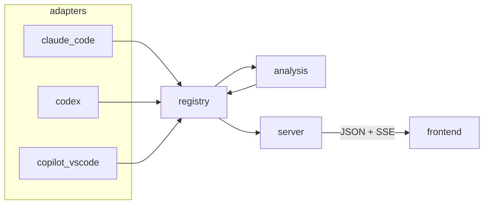

# Architecture

agentprof is a local web app that shows AI coding agent sessions as call trees with timings, tokens, cost and waste findings.
A Python backend parses session files into an agent-neutral model, analyses it, and serves it over a small JSON API to a React frontend.

This page is the map.
Detailed behaviour (data sources, roll-up rules, heuristic thresholds, UI details) is in [the design spec](agents/specs/2026-09-24-agentprof-design.md).
The activity track and the detail drawer's timeline, sub-agents and artifacts sections are detailed in [the activity timeline and context spec](agents/specs/2026-09-25-activity-timeline-context-design.md).

## Repository layout

```
src/agentprof/
  cli.py                  # `agentprof` command: build registry, resolve argument, run server, open browser
  model.py                # agent-neutral data model (Session, Node, Metric, ...)
  registry.py             # one row per session, background summaries, analysis cache, change events
  pricing.py, pricing.json  # model price table -> estimated USD
  adapters/
    base.py               # AgentAdapter protocol, SessionRef, SessionSummary, AdapterConfig
    __init__.py           # load_adapters(): instantiate entry points of group `agentprof.adapters`
    turns.py, timestamps.py  # helpers shared by adapters
    claude_code/          # ~/.claude/projects/<project>/<sid>.jsonl + subagents/
    codex/                # ~/.codex/sessions: grouped rollout JSONL files + subagents
    copilot_vscode/       # VS Code workspaceStorage: session + transcript + debug log
  analysis/
    pipeline.py           # analyze(): adapter parse -> link resolution -> roll_up -> evidence -> findings
    execution.py          # resolve source execution-event links to a unique call in the same logical agent
    call_context.py       # same-agent gaps and intervening event references
    evidence_findings.py  # findings based on cache, waits, resumes, and context evidence
    rollup.py             # derived metrics, bottom-up
    heuristics.py         # waste heuristics W1–W8 -> Findings
  server/
    app.py                # FastAPI app, SSE broadcaster, static file serving
    schemas.py            # Pydantic response models + mapping from the neutral model
    pricing_schema.py     # effective price-table response model
    openapi.py            # dumps the OpenAPI schema for frontend type generation
    static/               # built frontend (generated, git-ignored)
frontend/src/
  api/                    # fetch client, TanStack Query hooks, SSE handling, generated schema.ts
  pages/                  # SessionListPage (/), SessionPage (/sessions/:id)
  components/             # SessionView, SessionHeader, TreeTimeline, ActivityTrack, AxisLabels, ContextCell,
                          # NodeDrawer, NodeOverview, NodeFindings, NodeTimeline, ChildNodesTable, LlmCallsTable,
                          # CostSection, ArtifactsTable, ContextSection, FindingsDrawer
  lib/                    # pure logic with unit tests: tree, timeline, context, cost, artifacts, filters, paging, format, severity
tests/                    # pytest, mirrors src/ layout; adapter fixtures under tests/adapters/*/fixtures
tools/qa/                 # dev-only workspace package: `qa`, `build-dist`, `smoke` commands
docs/                     # conventions, releasing, specs and plans (docs/agents/)
```

## Layering



Keep these boundaries when changing code:

- `model.py` depends on nothing; everything else depends on it.
- Adapters know nothing about each other, the registry or the server.
- The analysis layer sees only the neutral model, never native tool ids or file formats.
- The server only translates the neutral model into response schemas; it holds no logic of its own.
- The frontend sees only the API; its types are generated from the OpenAPI schema.

## Components

### Neutral model (`model.py`)

A `Session` has a `root` `Node` of kind `session`, whose children are `turn` nodes (one per user prompt).
Turns and agents contain `agent` nodes (subagents, arbitrarily nested) and `tool` nodes (leaf tool calls).
Session roots, turns and agents retain their source execution events alongside their LLM calls.
An execution event records its kind, optional native event id and subject, occurrence time, source ordering metadata, result status and original execution-start/end snapshots.
Event-to-call links use an explicit `requested_by`, `consumed_by` or `next_observed_call` relation and retain whether the evidence was recorded or observed order.
Observed-order links remain qualified as inference and never imply exact consumption.
`analysis/execution.py` resolves only a unique nonempty source request id within the same logical agent stream.
The resolver accepts only the evidence pair `requested_by` or `consumed_by` with `recorded`, and `next_observed_call` with `observed_order`.
Timestamps and adjacency never create event-to-call causality.
Every number is a `Metric` or `CostMetric` carrying a `Provenance`: `exact`, `estimated` or `n/a`.
Token counts (`input`, `output`, `cache_read`, `cache_write`) are disjoint.
Cache writes may also have an exact `cache_write_5m` and `cache_write_1h` split, which together equal `cache_write`.
When a transcript only reports a total, both split fields are unavailable.
`context_size(tokens)` is the tokens sent to the model in one call: `input` plus `cache_read` plus `cache_write`.
`LlmCall.in_context` is false for side requests (e.g. a background summary or a helper model); they count for tokens and cost, never for the context.
A turn or agent node's `context_peak` is the largest context size of its own LLM calls; `compactions` are the times its own context was compacted.
The session node stands for the main agent's whole life: its `context_peak` and `compactions` cover all its turns, while its LLM calls stay on the turns.
Costs keep their native unit (`credits` for Copilot, `USD` for Claude Code) and are never added across units.
`CostMetric.usd_per_unit` converts a non-USD unit to dollars (`CostMetric.usd`), and the roll-up keeps it.
The Copilot adapter takes the rate from `usd_per_credit` in `pricing.json` (default $0.01, replaceable with `--pricing`).
The Codex adapter estimates API-equivalent USD costs through the shared price table because subscription usage has no per-session billed amount.
The API adds `usd` to every cost, and the session list sorts its cost column by it.
`ToolInfo.category` is the neutral tool class that heuristics use; `native_id` keeps the agent's own name.
`ToolInfo.writes_file` marks tools that write a whole file rather than editing part of one; the frontend uses it to label artifacts `created` vs `modified`.
`ToolInfo.paths` lists every file a call touches (e.g. each file of a Copilot multi-replace); `path` is its first entry.
Claude Code `SendMessage` calls retain their target and a short topic preview.
A successful explicit resume links to an agent node only when its target matches exactly one harness agent ID.

### Adapters (`adapters/`)

An adapter implements the `AgentAdapter` protocol in `adapters/base.py`:

| Method | Cost | Purpose |
|---|---|---|
| `discover()` | cheap | list `SessionRef`s (id, path, newest mtime of all the session's files) |
| `open_path(path)` | cheap | recognise a file given on the command line, else `None` |
| `summarize(ref)` | moderate | `SessionSummary` for the list row (title, workspace, times, total cost), no tree |
| `analyze(ref)` | full | complete `Session` tree with raw metrics |

Adapters are constructed with an `AdapterConfig` (root overrides, pricing file) and registered as entry points in `pyproject.toml`.
Each adapter package follows the same split: `discovery.py` finds files, parser modules read raw formats, `tools.py` maps native tool ids to `ToolInfo`, `tree.py` builds the neutral tree, `adapter.py` wires them together.
The Copilot session file records sub-agents' tool calls without arguments; `tree.py` takes them from the transcript's `tool.execution_start` events instead.
Claude Code's `tree.py` turns each `compact_boundary` transcript entry into an exact `Node.compactions` entry on the turn or agent in which it occurs (main transcript split by turn, or a sub-agent transcript); `<synthetic>` messages are outside the context.
Copilot's `tree.py` treats an agent's most frequent debug-log `debugName` as its conversation and marks other kinds as side requests; token counts the debug log does not record stay `n/a`.
Copilot keeps debug-log span IDs as call identities and links generated tool IDs through `agent_response` records whose span is `agent-msg-<request span>`.
Typed `tool_call_response` parts in debug request inputs identify result users; the earliest request containing a completed tool’s result is linked within the same agent stream.
Complete typed tool identity headers before Copilot’s truncation marker remain usable without retaining response content.
Missing or ambiguous metadata remains unresolved, and repeated result history in later calls does not duplicate the first-result-user link.
The Codex adapter groups rollout JSONL files by root session id, maps each `token_usage_record` to an LLM call, and nests subagent rollouts under delegation calls when their metadata permits it.
Adapters set only what they know (per-call tokens and cost, or totals); the roll-up derives the rest.
`summarize` must give the same total cost as the analysed session's root, which `tests/test_adapter_contract.py` checks: Claude Code adds `message_cost` over all transcripts with `model.sum_costs`, Codex adds every rollout token-usage record through `PriceTable.cost`, and Copilot adds each request's `copilotCredits`.
For a live Copilot session `read_session_state` finds the credits with a line scan: it JSON-parses only the snapshot, `requests` patches and `requests[N].copilotCredits` patches.
Parse problems go into `Session.diagnostics` rather than raising, unless the session is unreadable.

### Analysis (`analysis/`)

`pipeline.analyze(adapter, ref)` is the only entry point:

1. `adapter.analyze(ref)` builds the tree.
2. `execution.resolve_execution_links(root)` resolves valid source request identities within the same logical agent stream.
3. `rollup.roll_up(root)` fills own and total tokens, cost, time spans, tool call counts and context peaks bottom-up, propagating the worst provenance.
4. `call_context.annotate_call_context(root)` adds same-agent call gaps and intervening timing evidence.
5. The heuristic and evidence-finding passes produce findings for turn and agent nodes.
6. Findings are attached to the nodes they name.

`_roll_up_context` considers only calls in the context and sets a turn or agent node's `context_peak` to the largest `context_size` of its own calls.
Unless the adapter already set `compactions`, it estimates them: one entry at the later call's start wherever the context size drops below half (`_COMPACTION_DROP`) of the previous call's.
A sub-agent is checked over its own calls; the main agent is checked over the calls of all turns, and each entry goes to the turn of the later call.
The session node then takes the largest turn `context_peak` and all turn `compactions`, sorted by time.

### Registry (`registry.py`)

The registry holds one `SessionRow` per session and is the only stateful component.
A row's state (`pending`, `summarized`, `error`) is always relative to the session's current mtime, so a changed file makes it stale automatically.
A daemon thread re-runs `discover` every 3 seconds and otherwise summarises one pending row per `step()`, newest sessions first.
The worker never analyses: the list shows only summary fields, so it is ready within seconds even with hundreds of sessions.
Each adapter records the latest user or assistant message timestamp during its summary pass, including subagent messages where the source exposes them.
`session(id)` analyses on demand for the UI, deduplicates concurrent requests, and keeps an LRU cache of 20 analysed sessions keyed by mtime.
Every row change emits a `RegistryEvent` (`updated` or `removed`) to subscribers.
All public methods are thread-safe behind one `RLock`.

### Server (`server/`)

`create_app(registry, pricing=...)` builds the FastAPI app:

| Endpoint | Returns |
|---|---|
| `GET /api` or `/api/` | endpoint index with parameters and descriptions |
| `GET /api/sessions` | all rows as `SummaryOut`, newest first |
| `GET /api/sessions/events` | server-sent events: `updated` (a `SummaryOut`) and `removed` (`{id}`) |
| `GET /api/pricing` | effective price table, source, date, and longest-prefix matching rule |
| `GET /api/sessions/{id}` | `SessionOut`: the full tree with metrics and findings, without long texts; optional `depth` and `fields` projection |
| `GET /api/sessions/{id}/summary` | one compact row per distinct agent, including the main agent, with cost and cache breakdowns |
| `GET /api/sessions/{id}/findings` | flat findings ordered by known estimated avoidable cost, severity, and time |
| `GET /api/sessions/{id}/diagnostics` | parse counts and bounded redacted malformed-line details |
| `GET /api/sessions/{id}/nodes/{node_id}` | `NodeDetailOut`: prompt, result, raw tool arguments |
| `GET /sessions/{id}` with JSON `Accept` or `format=json` | the same `SessionOut` as the API route |
| `GET /` and `/sessions/{id}` | built frontend shell |

`depth=0` keeps only the session root; larger depths include that many descendant levels and mark omitted children.
`fields` accepts `session`, `diagnostics`, and `tree` as comma-separated top-level groups.
Unknown field names and invalid depths return 422.
The default request still returns the complete `SessionOut` shape.
Unknown paths return 404.

Session HTML includes a link to its JSON representation and an API discovery pointer.
Summary `own_cost` includes only an agent's direct calls, so summing it across rows does not count descendants twice.
Summary `subtree_cost` includes an agent and its descendants and must not be summed across rows.
The summary's `cold_rewrites` counts measured large writes with little cache reuse after an agent's first call.
Its cost is the observed cache-write cost when the TTL split and price are known, not a claim of avoidable spend.
Call gaps use the previous call's end when known, otherwise its start with estimated provenance.
Preceding events contain IDs and times only; raw prompts and tool text remain on the node detail route.
Malformed-line details are capped and redact values; skipped records can make totals incomplete.
The `Broadcaster` moves registry events from the worker thread onto the asyncio loop and into one queue per SSE client.
Unknown ids give 404; a session that fails to analyse gives 422 with the error message.

### Frontend (`frontend/`)

Vite, React, TypeScript, Mantine (auto dark mode), react-router, TanStack Query, Table and Virtual.
`pnpm --dir frontend build` writes a single bundle into `src/agentprof/server/static/`, which ships inside the wheel.
The dev server (`pnpm --dir frontend dev`) proxies `/api` to a running `agentprof` on port 8765.

```
main.tsx          MantineProvider -> QueryClientProvider -> BrowserRouter -> App
App.tsx           useSessionEvents() once; routes "/" and "/sessions/:sessionId"
pages/
  SessionListPage   session table with filters
  SessionPage       loads one session, renders SessionView
components/
  SessionView       owns inspection location, shared entity selection, session interaction and split-pane state
  SessionHeader     title, badges, headline figures, switches, diagnostics warnings
  TreeTimeline      virtualised tree table with the timeline column
  ActivityTrack     one node's activity on a time view; tree timeline column and NodeTimeline
  AxisLabels        evenly spaced time labels for a time view
  ContextCell       a node's peak context size; tree table column
  NodeDrawer        tabbed details and call focus of the selected node; composes the components below
  NodeOverview      task, outcome, previews and own/inclusive metrics for one node
  NodeFindings      grouped findings and expandable evidence for one node
  ContextSection    a node's context figures and stacked bar chart of its own LLM calls
  CostSection       a time-aligned bar chart of one agent's LLM call costs
  LlmCallsTable     each own LLM call's metrics and expandable details with direct tools
  NodeTimeline      mini Gantt of a node and its direct sub-agents
  ChildNodesTable   a node's direct sub-agents, or a session's turns
  ArtifactsTable    files written or edited by a node's own tool calls
  SessionInteraction shared session interaction context and session-scoped inspection memory
  DetailLink        caption links that open inspection independently of row marking
  InspectionMenu    shared keyboard, pointer and touch context menu
  ActivityHitGroup  local aggregate marks and explicit candidate inspection
  FindingsDrawer    all findings of the session
lib/                pure functions, no React: tree, timeline, context, cost, entities, inspection/workflow locations,
                    workflow state/scope/reading, entityHitGroups, artifacts, findingGroups, filters, paging, format, severity
api/                client, query hooks, SSE, types
```

#### Data layer (`api/`)

`schema.ts` is generated from the server's OpenAPI schema by `pnpm --dir frontend gen:api`; never edit it by hand.
`types.ts` re-exports its schemas under short names (`SummaryOut`, `SessionOut`, `NodeOut`, ...), and all other code imports from there.
`client.ts` holds the fetch functions and the query keys: `["sessions"]`, `["session", id]` and `["node", id, nodeId]`.
`hooks.ts` wraps them as `useSessions`, `useSession` and `useNode`; the node query only runs once a node is selected.
Queries never go stale by themselves (`staleTime: Infinity`, no refetch on focus): only server events refresh data.

`events.ts` opens one `EventSource` on `/api/sessions/events` for the whole app:

- `updated` replaces the row in the `["sessions"]` cache and re-sorts it by mtime.
- If the event's mtime is newer than a cached `["session", id]`, that session and its node details are invalidated and refetched in the background.
- `removed` drops the row from the list cache.
- A (re)connect invalidates the list, so events missed while disconnected cannot leave it stale.

Because `SessionPage` keys `SessionView` by session id only, a background refetch keeps expansion, selection and zoom.

#### Session list (`pages/SessionListPage.tsx`)

A TanStack Table over `SummaryOut` rows with the columns agent, title, workspace, last activity, start, duration and cost.
Last activity sorts newest first by default; rows without a known message time appear last.
Filters above the table (agent segmented control, workspace select, free-text search) are applied by `lib/filters.ts` before sorting.
Every column sorts on click; missing values sort last.
The table is paged in the browser: filtering and sorting cover all sessions, then the current page is cut out.
The page size (25, 50, 100 or 200, default 50) is remembered in `localStorage`; page logic lives in `lib/paging.ts`.
Changing a filter, the sort or the page size goes back to the first page; live updates keep the page.
A row whose summary failed gets an `error` badge next to its title, with the message as tooltip.
Titles and costs fill in as the registry worker progresses, driven by SSE events.
On phones, the same seven-column TanStack table scrolls horizontally inside its own container.
A row click, Enter or Space navigates directly to `/sessions/<url-encoded id>` on desktop and phone.
Native error disclosures expose session errors on phone without hover.
The session list keeps native row navigation without local marking, details icons, or inspection menus.

#### Session view (`components/SessionView.tsx`)

`SessionView` coordinates inspection, shared selection, scope, activity filtering, reading position, follow mode, and session view state, while `NodeDrawer` and its child tables render details:

| State | Meaning |
|---|---|
| `expanded` | set of expanded session/turn/agent node ids; the session and turns with sub-agents start expanded |
| `inspectionLocation.nodeId` | node id from the URL's `node` parameter; this opens the drawer and is distinct from the selected entity |
| `inspectionLocation.tab` | active detail tab from the URL's `tab` parameter, with the node kind's default used when absent |
| `inspectionLocation.selection` | selected `EntityRef`, either a node or a call identified by its owner and stable call key |
| `inspectionLocation.invalidSelection` | URL selection fields were present but invalid, so the UI reports it unavailable until cleared |
| `SessionInteraction` | context exposing inspection, resolved selection, navigation actions, reveal actions and in-memory session state |
| `findingsOnly` | show only nodes with findings and their ancestors |
| `workflowLocation` | `scope` hierarchy root and `activity` filter from the URL, independent of inspection and selection |
| `workflowIndex` | one indexed tree traversal with node, parent, depth, own-state, and logical-agent observations |
| `scopeOnly` | session-local switch limiting the agent list to logical agents represented inside a valid focused subtree |
| `followLatest` | session-local, default-off mode for revealing newly observed eligible records |
| `mobilePanel` | mounted Workflow or Agents workspace panel selected on phone |
| `findingsOpen` | `FindingsDrawer` open |
| `range` | timeline zoom as `[from%, to%]` of the session span |

The session node is the top row, with the turns below it; tool calls are never tree rows.
`node=<node-id>` controls which node is inspected in the drawer, while `sel=node&entity=<node-id>` or `sel=call&owner=<node-id>&call=<call-key>` independently identifies the selected entity.
Node selections use `EntityRef` values with the session id and node id; call selections also carry the owning node id and a stable call key.
Native call ids use `id:<native-id>` only when the id is nonempty and unique among all calls owned by that node.
A call without a nonempty native id can use `time:<timestamp>` only when its start is exact, finite and unique among that owner's calls.
Duplicate nonempty native ids are ambiguous and cannot fall back to timestamps.
Duplicate start times make timestamp fallback ambiguous, but do not prevent selection by a unique native id.
Calls lacking both a unique nonempty native id and an exact, finite, unique start time remain expandable but cannot be durably selected.
Invalid, missing or no-longer-resolvable selection identities appear as one passive unavailable note.
Selection-only URLs keep collapsed or offscreen representations in place; URLs with an explicit inspected node retain legacy detail-link reveal behaviour.
Within a session, clicking an inspection row, bar or segment marks it without opening details, changing tabs, expanding rows or changing filters and zoom.
Triangles expand or collapse their item; topic and caption links open the corresponding details independently of row marking.
Caption links use the pointer cursor, while marking rows, bars and segments use the default arrow cursor.
The shared context menu also explicitly inspects items.
Cost and context charts use context menus for explicit inspection; workflow timeline captions link to their child nodes.
Right-click, Shift+F10, the ContextMenu key and a 500 ms touch long-press open the same menu without navigation.
Menus list labeled candidate actions for inseparable overlapping activity rather than opening an arbitrary candidate.
Addressable marks replace the current history entry while preserving inspection parameters; explicit inspection pushes a destination entry.
Changing tabs replaces the current entry; closing the drawer removes only `node` and `tab`, retaining selection and unrelated search parameters.
The query writer preserves unrelated parameters and maps call references without losing reserved native id characters.
`scope=<node-id>` focuses a session, turn, or agent subtree, and `activity=all|running|waiting|completed|failed|unknown` filters own observed state.
The whole-session scope and `all` activity are omitted from the URL; scope and activity patches preserve inspection and selection fields.
Invalid scope or activity values remain in the URL while the interface shows the whole-session/all-activity fallback until explicit reset.
Scope breadcrumbs show the focused hierarchy, while drawer breadcrumbs continue to show the inspected node's complete ancestry.
On phone, a Workflow/Agents switch displays one mounted workspace panel at a time and preserves each panel's scroll position.
The phone header and toolbar occupy a locally scrollable region bounded to 40dvh, and focused/inspected ancestry lists scroll locally within a 128 px bound.
The agent list remains All agents by default, with an explicit focused-subtree switch that filters membership while retaining complete-agent totals.
The agent summary labels its accounting “Complete-agent totals; session cost share” and keeps the existing session-wide cost-share denominator.
Activity filtering uses combined observations for each logical agent in that list and each row's own state in the hierarchy.
Exact selections use a blue background or tint only on concrete representations of the same node or call.
Owners, ancestors, descendants, requesting calls, consumers and resumed nodes are not highlighted by association.
Transient local marks are used for nonaddressable rows and inseparable visual aggregates without manufacturing URL identities.
On refresh, artifact paths and findings retain local marks only when uniquely matchable in both snapshots; ambiguous or positional local marks expire.
The context menu closes when its source disappears or the session snapshot changes.
Changing tabs displays an existing mark when its representation is present, without revealing, expanding or scrolling it.
Explicit chart inspection uses a stable `{ref, version}` request and resolves against the latest tree after the destination commits.
The `SessionView` memory map holds the last tab per inspected node, expanded rows per node and table, and panel reading positions per inspected node.
Drawer width settings are remembered for the session.
Back and Forward restore history snapshots of that memory, tree expansion, findings filter, zoom and tree scroll; a session refetch keeps current manual state.
Closing details retains selection, and selecting a cost chart bar never changes the active tab.
The cost graph stays above the call table and remains usable alongside its selected call.
`lib/tree.ts` derives the findings-only row set, flat row list, and sorted findings.
`lib/workflowState.ts` derives state from own completion events and the latest comparable call/event observations.
An own completion has no subject, an empty subject, or a subject equal to its owner; child completion does not complete the parent.
Finite source order takes priority within the same nonempty stream; when it does not order a pair, unequal finite timestamps provide the other ordering evidence.
Incomparable observations and ties leave the latest owner unknown, while cycles do not provide terminal proof.
These comparisons establish ordering only and never establish causal links between calls and events.
Running and waiting states are inferred from the latest unambiguous owner activity; retained completion evidence remains in observations and appears in running or waiting capsule tooltips when applicable.
Tool results, failed tools, end rollups, `active` flags, silence, and file timestamps do not establish terminal agent state.
Known workflow states use small coloured capsules with tooltips that qualify inferred activity and recorded outcomes; unknown state has no indicator.
`lib/workflowScope.ts` builds the native node/parent index and applies scope plus direct row matches before adding matching rows' ancestor closure.
Scope is hierarchy visibility, activity and Findings only match each row's own state, and context-only ancestors carry a neutral “Context ancestor” label.
Tool findings map to their containing hierarchy row, and tools never become hierarchy rows.
`lib/workflowLocation.ts` reads and patches only `scope` and `activity`, preserving selection, inspection, and unrelated query parameters.
Unknown URL values remain in the address while the view reports a fallback until an explicit reset or filter choice.
`workflowScope` combines observations for every native turn/agent node sharing an `agent_id`, while focus still identifies one native node.
Agent rows use complete logical-agent own metrics across turns and resumes, with the existing session-wide own-cost percentage denominator.
Latest observed activity links to its unambiguous owner when available; ties retain independently known time without choosing an owner.
Source updated uses API file mtime in seconds converted to milliseconds, Fetched uses React Query `dataUpdatedAt` milliseconds, and Latest observed activity uses the latest finite nonnegative call/event timestamp in milliseconds.
Each freshness value is formatted independently as a full local timestamp, and invalid, out-of-range, or missing values display as unavailable.
These timestamps describe source modification, successful fetch, and observed record time respectively; they do not prove a live worker or current execution.
`lib/workflowReading.ts` captures a visible native row key and pixel offset, restores the same row after updates, falls back to a surviving nearby key when it disappears, and clamps the offset.
Back/Forward restores the history snapshot and pauses follow, while source updates and breakpoint changes preserve the current anchor when possible.
Follow latest is off by default and session-local; it reveals only a newly observed, unambiguous record whose owner matches current scope and filters.
Unchanged fetches and ambiguous additions do not trigger a reveal, and manual scrolling, wheel/touch input, zoom, filtering, scope, expansion, Escape, or detail navigation pauses follow.
Pending reveals wait while a workspace panel is hidden, and native EventSource invalidation supplies the refreshed snapshot without changing selection, inspection, or zoom.
Finding rows and artifact rows mark locally; finding message links and artifact path links open the supporting node or producer candidates.
An artifact with several producers opens a labeled chooser instead of choosing a producer arbitrarily.
Finding group and evidence disclosures expand only from their triangle controls.
Agent summary rows mark their existing representative node; Agent 1 maps to the session root.
The agent summary shows activity, representative topic and latest observed activity alongside each complete logical-agent row.
Agent 1 uses the session title as its representative topic, while sub-agents use their representative agent node topics.
Its observed activity is aggregated from all owned turn/agent nodes and does not rely on the session root's active turn alone.
The agent table retains all 12 fields: agent, activity, topic, latest observed activity, model, cache TTL, resumes, duration, costs, and total, input, and output tokens.
The native phone disclosure retains its labeled model, duration, own cost, input/output/total tokens, cache TTL, and resume count values.
The caption remains visible and independently markable while the disclosure is closed.

`SessionHeader` shows title, agent and source badges, the findings-only switch and the findings button, then the figures workspace, duration, cost, tokens, LLM calls and tool calls.
Diagnostics (warnings, malformed lines, unknown tool ids) appear as a yellow alert below.

#### Tree table and timeline (`components/TreeTimeline.tsx`)

A CSS grid with the columns topic, agent, model, duration, cost, tokens, context and timeline, shared by the header row and every body row.
The wide metric grid scrolls within its own container without widening the document.
Topic text links open the corresponding node details.
Rows are virtualised with TanStack Virtual at 30 px on desktop and 176 px on phone, so sessions with thousands of nodes stay fast.
At the `48em` breakpoint, the phone row bounds indentation, keeps state/task/cost text visible, and provides local overflow for the timeline and ancestry lists.
The phone tree keeps the same metrics reachable through Overview and Workflow details and provides 44 px essential row, caption, triangle, context-menu, and track hit areas.
Rows are the session, turns and agents (`lib/tree.ts`'s `isRowNode`); tool calls never get their own row.

- **Topic** is indented by depth, with an expand toggle, a kind mark (`▣` turn, `◆` agent, none for the session), a findings count, a qualified workflow state, and an independent `failed` badge for `success === false`.
- The findings badge counts the node's own findings plus those of its direct tool calls (`rowFindingCount`).
- **Cost** shows inclusive `cost_total`; its tooltip shows `cost_own`, while phone rows label own and subtree cost separately.
- **Tokens** is the sum of the four counts of `tokens_total`.
- **Context** (`ContextCell`, `data-testid="context-<id>"`) shows `context_peak`; the tooltip adds the number of `compactions`.

The timeline column renders an `ActivityTrack` per row (see below).
Above the column, a range slider selects the zoom window and `AxisLabels` shows five time labels since session start.
Rows use ARIA grid roles and are keyboard-activatable; clicking or pressing Enter/Space marks the row, while its triangle alone toggles expansion.
Caption links inspect independently of marking, and scope focus is available from the shared toolbar and row context menu.

#### Activity track (`components/ActivityTrack.tsx`, `components/AxisLabels.tsx`)

`ActivityTrack` draws one node's activity on a time `view`, used both in the tree's timeline column and in the drawer's `NodeTimeline`:

- a background span in the node's kind colour (gray for turn, violet for agent; red if the node failed);
- a top lane with the node's own LLM calls (gray bars, or thin ticks when a call has no known duration) and its direct tool calls, merged where they overlap (blue, red if any merged call failed);
- a bottom lane with its direct sub-agents, merged where they overlap (violet);
- context menus for explicit inspection of an exact item or labeled overlapping candidates.

It carries `data-testid="track-<id>"`.
All geometry lives in `lib/timeline.ts`: `nodeSpan` (a node's own span), `zoom` (percent range to a time window), `bar` (clipped left/width in percent for one interval), `mergeSegments` (overlapping nodes into `Segment`s), `activityOf` (a node's own LLM calls, ticks, tool segments and sub-agent segments), `placeSegments` (segments positioned on a view), `segmentsAt` (segments under a pointer percentage), `ticks` and `axisLabels`.
Context figures live in `lib/context.ts`: `contextCalls` (a node's own sized calls in the context, sorted by start; for the session node those of all its turns), `contextFigures` (peak, compaction count and mean growth per call), `contextAt`, `contextScale`, `contextBars` and `compactionMarks` (chart geometry, used by `ContextSection`).
Cost events live in `lib/cost.ts`: the session gathers the main agent's calls from its turns, while a turn or agent uses only its own calls.
The Workflow tab uses `lib/inspectionSequence.ts` to project calls, one display row per tool invocation and other activity into a compact chronological table.
Tool invocation rows preserve their underlying start and optional result evidence, source links, failure status and legacy event mappings.
Only contiguous tool invocations group together, groups start collapsed and their count measures invocations rather than source events.
Expanding a group opens each tool’s details immediately; individual triangles can subsequently collapse those details.
Search may reveal matching rows and groups; ordinary marks never expand or scroll the table.
The five columns are Time, Item, Duration, Cost and Tokens; call token totals use all recorded token categories.
Collapsed rows occupy one line, with numbered LLM call labels, tool names only in Item and comma-separated tool names on group rows.
Time and numeric columns have bounded widths, Item uses the remaining space and numeric cells align right beneath their headings.
Triangles expand calls, groups and tool invocations.
Call labels, tool names and activity captions link to their corresponding inspection, opening inline evidence when no addressable entity is available.
Expanded tool details show labeled timing and outcome fields, full command and paths, and an ordinary link to the tool detail page.
Tool details expose Requester beneath Started and Result user beneath Finished as linked LLM call numbers, or Unavailable when no unique recorded relationship resolves.
These links clear a search hiding the destination, scroll to its row and mark it without expanding it; calls owned elsewhere open their owner’s Workflow tab.
Tool and LLM call details omit technical source evidence; activity disclosures retain their existing evidence.
On narrow screens the Calls table scrolls horizontally within its own container instead of turning rows into cards.
Expanded details wrap within the phone width so timing, outcome and arguments stay readable.
Sortable metric headers preserve unknown values and expose when tool grouping follows calls in a sorted view.
The cost chart always uses elapsed time, retains timing-basis notes, keeps unknown cost distinct from zero and leaves untimed calls in the table.
Tool rows do not inherit LLM cost or token values.

#### Drawers

`NodeDrawer` opens on the right for the selected node, which may be a tool call, and defaults to 60 % width on desktop.
The desktop width can be adjusted from 45 % to 90 % with the native range control or toggled between its current width and full width.
At viewport widths of 48 em or less, the drawer fills the viewport and hides the desktop width controls.
The node identity, parent navigation and tabs remain outside the active panel's scroll area.
The title includes a To parent button for every node except the session root; tools and sub-agents navigate to the nearest calling agent, turns navigate to the session root, and the main agent navigates to the session root.
The drawer header also shows the node kind, model and tool badges, including the native tool id and category.
The drawer's inspected node, tab, selected entity, call focus and expanded rows are coordinated through `SessionInteraction`.
Tabs, call expansion, panel reading positions and drawer width are remembered per session while navigating between inspected nodes.
The Workflow tab keeps timeline, cost and context charts above the collapsible call table; marking a chart bar updates only the exact call selection.
Selection can refer to a call owned by a different node than the drawer's inspected node, and it has no persistent action panel.

Non-tool nodes have three tabs: Overview, Workflow and Content, with Overview selected by default; tool nodes expose Overview and Content, with Content selected by default.
All tabs stay mounted while switching between them.

Overview shows the task topic and outcome, prompt and result previews when available, duration, own and inclusive costs, LLM and tool call counts, and findings.
Its permanently visible Metric details heading and tables contain start time, user wait and a six-category own/inclusive token table.
`NodeFindings` groups findings by heuristic and severity, with each finding's message, estimated avoidable cost and expandable evidence.
The context details show peak, compaction count and mean growth per call, plus the node's own calls as cache-read, cache-write and uncached-input bars with a mark for each compaction.
For the session node, context and own cost figures cover the main agent's calls across its turns; inclusive cost still includes descendants.
`ContextSection` uses `data-testid="context-section"` and `data-testid="context-chart"` for its chart.

Workflow places `NodeTimeline`, `CostSection` and `ContextSection` in that order above collapsible Sub-agents and LLM calls sections.
The three charts use one `lib/drawerTimeDomain.ts` plotting interval, elapsed origin, fixed label column and equal plot insets within one horizontally scrolling surface.
Cost and context show elapsed-time labels and quantitative y axes in USD per call and tokens, with labeled zero baselines and roughly three round-value horizontal guides.
The interval includes finite observed node/child times, own call starts and ends, and compaction times.
A single timestamp receives a one-second plotting interval without inventing a recorded duration, and unavailable timing stays unavailable.
Both lower sections start expanded and remember disclosure state per inspected node.
Their section titles replace repeated Sub-agents and LLM calls captions inside the disclosures.
Explicit call or event navigation reveals the containing section; marking a chart bar never opens it.
Legacy `tab=calls` URLs resolve to Workflow, while new call and event links use `tab=workflow`.
The timeline shows the node's own activity and one track per direct sub-agent, or per turn for the session node; marking a track does not navigate, while child caption links open child details.
`NodeTimeline` uses `data-testid="node-timeline"` and `data-testid="timeline-row-<id>"`, and its label column aligns with the time chart.
`ChildNodesTable` uses `data-testid="turn-<id>"` for session turns and `data-testid="sub-agent-<id>"` for direct sub-agents, with start, duration, topic, model, tokens, own cost and inclusive cost.
Expanding a child row reveals that child's own calls and its nested subordinate hierarchy, preserving the owning turn or agent.

The LLM calls section retains the compact invocation sequence and the session root's Turns grouping.
For session nodes, calls and tools stay grouped by owning turn; for turns and agents, the table shows that owner's own calls and execution events.
Call rows show recorded start time, duration, cost and total tokens; expansion retains detailed timing, cost parts and token categories.
Tool groups and tool rows expose their own invocation times and requester/result-user links without duplicating result events.

Content lists artifacts and loads the selected node's full prompt, result and pretty-printed tool arguments on demand, with loading and error states.
`ArtifactsTable` lists paths written or edited by the node's own direct tool calls, with action, edit count and a failure badge, using `data-testid="artifact-<path>"`.
On narrow screens, child topics and artifact paths wrap, while the timeline, cost and context charts scroll together inside their shared container.

`FindingsDrawer` lists all findings sorted by severity, then heuristic id, with the topic of the node each belongs to; a row mark stays local, while its message link opens the supporting node.

#### Display conventions (`lib/format.ts`)

- Missing values are shown as `–` (`MISSING`); estimated values get a `≈` prefix (`withProvenance`).
- Cost is formatted in its own unit: `$0.0123` / `$1.23` for USD, `$0.01 (1.23 cr)` for credits, dollars first.
- Durations adapt from `ms` to `h m`; tokens use `k` and `M`.
- `truncateTitle` limits displayed task titles and entry captions to 100 Unicode code points including a trailing `…`, while original values remain available for search, sorting, tooltips and detailed content.
- Agent ids map to display labels in `AGENT_LABELS`; severities map to colours in `lib/severity.ts`.

#### Frontend tests

- Vitest covers everything in `lib/` and `api/events.ts`; `src/test/factories.ts` builds typed test data (`makeNode`, `makeTool`, `makeSummary`, `makeSession`).
- The Playwright smoke test (`e2e/smoke.spec.ts`) starts the real `agentprof` on the Claude Code fixtures and drives the list, the tree, both drawers and finding reveal.
- It selects elements by `data-testid` (`session-row-<id>`, `tree-row-<key>`, `toggle-<key>`, `track-<id>`, `context-<id>`, `context-section`, `context-chart`, `cost-section`, `cost-chart`, `cost-bar-<owner>-<index>`, `call-cost-<owner>-<index>`, `node-timeline`, `timeline-row-<id>`, `turn-<id>`, `sub-agent-<id>`, `artifact-<path>`, `tool-call-<id>`, `finding-<W>-<node>`); keep these stable.

Put new logic in `lib/` as pure functions with tests, and keep components to layout and wiring.

### CLI (`cli.py`)

`agentprof [SESSION|PATH] [--host] [--port] [--no-browser] [--copilot-root] [--claude-root] [--codex-root] [--pricing]`.
It loads adapters, runs one synchronous `registry.refresh()`, resolves the optional argument (exit code 2 if unknown or ambiguous), starts the worker thread, and runs uvicorn.
The browser opens once the server accepts connections: `_Server.startup` calls the `on_started` callback after binding the socket.

## Data flow

### Startup and background

```
cli.main
  -> load_adapters(config)                    entry points -> adapter instances
  -> Registry.refresh()                       adapter.discover() -> pending rows
  -> Registry.start()                         worker thread:
       every 3 s: refresh()                   new / changed / vanished sessions
       step():    adapter.summarize(ref)      -> row.summary       -> event "updated"
  -> uvicorn(create_app(registry))
```

### Session list

```
browser GET /api/sessions -> registry.rows() -> summary_out(row) -> SummaryOut[]
registry event -> Broadcaster -> SSE "updated"/"removed" -> api/events.ts -> query cache -> table re-renders
```

### Session view

```
browser GET /api/sessions/{id}
  -> registry.session(id)                     cache hit by mtime, or:
       pipeline.analyze(adapter, ref)         adapter.analyze -> resolve links -> roll_up -> evidence -> findings
       cache (LRU 20)
  -> session_out(session, mtime) -> SessionOut
node selected -> GET .../nodes/{node_id} -> node_detail_out(node) -> prompt, result, arguments
file changes -> worker emits "updated" with newer mtime -> frontend refetches the open session
```

## Extending

### Add an agent adapter

1. Create `adapters/<name>/` with the usual split (`discovery`, parsers, `tools`, `tree`, `adapter`).
2. Implement the four protocol methods; `name` becomes the id prefix `<name>:<native-id>`.
3. Include every file the session depends on in the `SessionRef.mtime` (use `latest_mtime`), so edits re-trigger analysis.
4. Map every native tool id in `tools.py`; unknown ids map to `other` and are counted in diagnostics.
5. Register it under `[project.entry-points."agentprof.adapters"]` in `pyproject.toml` and add a root option in `cli.adapter_config` if it has a data root.
6. Add small anonymised fixtures under `tests/adapters/<name>/fixtures` and add the adapter to `tests/test_adapter_contract.py`.
7. Add a display label in `frontend/src/lib/format.ts`.

### Add a heuristic

Add a `_check_*(node) -> list[Finding]` function in `analysis/heuristics.py` and append it to `_CHECKS`; `find_findings` runs every check on every turn and agent node.
Use only tool categories, normalised arguments and metrics.
Add one positive and one negative test in `tests/analysis/test_heuristics.py`.

### Change the API

1. Change the model in `server/schemas.py` and its mapping function there.
2. Run `pnpm --dir frontend gen:api` and commit the regenerated `frontend/src/api/schema.ts`; CI checks that it is current.
3. Update `frontend/src/test/factories.ts` if the shape of test data changes.

### Change the session view

- A new tree column: update the tree grid CSS module, add the header cell, and add the cell to `NodeCells`.
- A workflow scope or activity filter: add pure matching and ancestry logic to `lib/workflowScope.ts`, URL patching to `lib/workflowLocation.ts`, and wire the shared controls through `SessionView` and `WorkflowToolbar`.
- A new session-view switch: keep its state and navigation policy in `SessionView`, expose it through the relevant toolbar or header, and use an indexed pure helper for row matching.
- A new timeline mark: add its geometry to `lib/timeline.ts` with a test, and draw it in `ActivityTrack`.
- A value the API does not carry yet: change the API first (see above).

### Add a derived metric

If the metric can be computed from what adapters already provide, compute it in `analysis/rollup.py` for all agents rather than in an adapter.

## Tooling

- `uv run qa` runs ruff, ty and pytest, plus Biome, `tsc` and Vitest when the frontend is set up.
- `pnpm --dir frontend e2e` builds the frontend and runs a Playwright smoke test against the fixture sessions.
- `uv run build-dist` builds frontend, wheel and sdist and smoke-tests the wheel; see [releasing.md](releasing.md).
